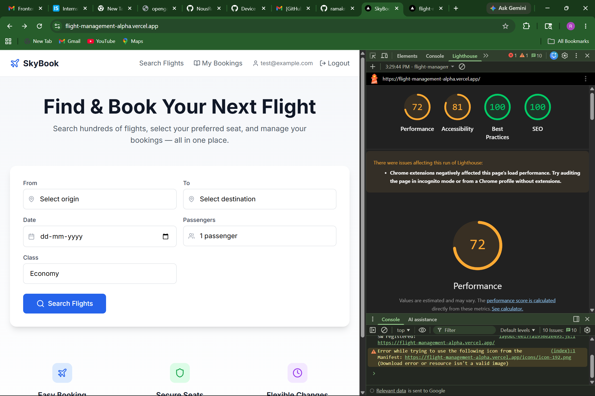

# SkyBook — Flight Management Web App

A responsive, production-like flight management application where passengers can search and book flights, select seats interactively, reschedule, and cancel bookings.

## Tech Stack

- **Framework**: Next.js 14+ (App Router) + TypeScript
- **Backend**: Supabase (PostgreSQL + Auth + Realtime)
- **State Management**: Zustand with persist middleware
- **Styling**: Tailwind CSS
- **Icons**: Lucide React

## Setup Instructions

### 1. Clone & Install

```bash
git clone <your-repo-url>
cd flight-management
npm install
```

### 2. Supabase Setup

1. Create a new project at [supabase.com](https://supabase.com)
2. Go to **SQL Editor** and run the migration files in order:
   - `supabase/migrations/001_enums.sql`
   - `supabase/migrations/002_create_tables.sql`
   - `supabase/migrations/003_rls_policies.sql`
   - `supabase/migrations/004_rpc_functions.sql`
   - `supabase/migrations/005_booking_constraints.sql`
   - `supabase/migrations/006_indexes.sql`
   - `supabase/migrations/007_seed_data.sql`

3. Create a test user in **Authentication > Users > Add User**:
   - Email: `test@example.com`
   - Password: `test123456`

4. Copy `.env.example` to `.env.local`:
   ```bash
   cp .env.example .env.local
   ```

5. Fill in your Supabase URL and anon key from **Settings > API**

### 3. Run Development Server

```bash
npm run dev
```

Open [http://localhost:3000](http://localhost:3000)

## Architecture Decisions

### Two-Phase Seat Booking
The app uses a two-phase booking process:
1. **reserve_seat()** — Temporary 5-minute lock during passenger form filling
2. **confirm_booking()** — Permanent seat allocation after form submission

This prevents seats from being held by users who abandon the checkout flow.

### Supabase Realtime
Seat maps subscribe to Supabase Realtime on the `seats` table (filtered by flight_id). When another user books a seat, the map updates instantly without page refresh. Proper channel cleanup on unmount prevents memory leaks.

### Zustand Store with persist + partialize

**useFlightStore** — Persists search query, selected flight, and booking step. Uses `partialize` to **exclude passport numbers** from localStorage for security.

**useUserStore** — Persists only the Supabase auth session and cached bookings for offline access.

Both stores include a `resetBooking` / `clearSession` action triggered on logout, cancellation, or successful booking.

### DB-Level Enforcement
- **Cancellation rule**: A PostgreSQL trigger (`cancellation_guard`) rejects cancellations within 2 hours of departure — enforced at DB level, not just application level.
- **Seat locking**: `FOR UPDATE` row-level locks in RPC functions prevent double-booking race conditions.
- **RLS policies**: Users can only access their own bookings, passengers, and reschedules.

### PostgreSQL Enums
Used for `seat_class`, `booking_status`, and `flight_status` to enforce type safety at the database level.

## Zustand Store Structure

```
useFlightStore (persist: flight-storage)
├── searchQuery: { origin, destination, date, passengers, class }
├── selectedFlight: Flight | null
├── selectedSeat: Seat | null
├── bookingStep: 1 | 2
├── passengers: PassengerForm[]  (passport_no excluded from localStorage)
├── setSearchQuery(), setSelectedFlight(), selectSeat(), clearSeat()
├── setBookingStep(), setPassenger(), addPassenger(), removePassenger()
└── resetBooking()  ← called on logout/cancel/success

useUserStore (persist: user-storage)
├── session: Session | null
├── setSession(), clearSession()  ← called on logout
```

## Server Components

- **Search page** (`/search`) — Server Component. Fetches flights server-side via Supabase SSR client.
- **Booking page** (`/booking/[flightId]`) — Server Component. Fetches flight and seat data server-side.
- **My Bookings page** (`/my-bookings`) — Client Component. Requires auth state and interactive modals.
- **Auth pages** — Client Components. Use Supabase Auth browser client.

## Deployment

### Deploy to Vercel

1. Push code to GitHub repository
2. Import project in [Vercel](https://vercel.com)
3. Set environment variables:
   - `NEXT_PUBLIC_SUPABASE_URL`
   - `NEXT_PUBLIC_SUPABASE_ANON_KEY`
4. Deploy — Vercel automatically builds and deploys on push

### PWA Verification

After deployment, run Lighthouse to verify PWA compliance:
1. Open Chrome DevTools → Lighthouse
2. Select "Progressive Web App" category
3. Verify all checks pass (installable, offline support, manifest, service worker)

### Lighthouse Scores

| Category | Score |
|---|---|
| Performance | 72 |
| Accessibility | 81 |
| Best Practices | 100 |
| SEO | 100 |

> Screenshots taken via Chrome DevTools → Lighthouse on the deployed URL.

### Lighthouse PWA Score



## Trade-offs & Limitations

- **No payment integration**: Booking completes without real payment. Would integrate Stripe in production.
- **Single seat per booking flow**: Architecture supports multiple passengers, but they share one seat selection. Real airlines would have per-passenger seat selection.
- **In-memory seat locks**: Locks are in PostgreSQL. Fine for demo scale; would use Redis for production.
- **No email notifications**: Confirmations are in-app only. Would add Resend/SendGrid in production.
- **Scheduled lock cleanup**: Uses pg_cron or manual invocation. Would use a background worker in production.
- **PWA icons**: Placeholder icons are included. Replace `public/icons/icon-192.png` and `icon-512.png` with real 192x192 and 512x512 PNG icons for production.

## Features Implemented

- Flight search by origin, destination, date, passenger count, and class
- Search results with flight cards showing price, duration, and class options
- Interactive seat map with color-coded availability (available/selected/occupied/locked)
- Supabase Realtime subscription for live seat updates
- Two-phase booking with 5-minute seat lock
- Passenger details form with multiple passenger support
- Confirmation page with PNR code and copy-to-clipboard
- My Bookings page with status badges (confirmed/rescheduled/cancelled)
- Reschedule modal to pick alternative flights on the same route
- Cancel booking with confirmation dialog and 2-hour rule enforcement
- Responsive design (mobile, tablet, desktop)
- Auth pages (login/register) with Supabase Auth
- Navbar with mobile hamburger menu
- PWA manifest and offline fallback page (bonus)
